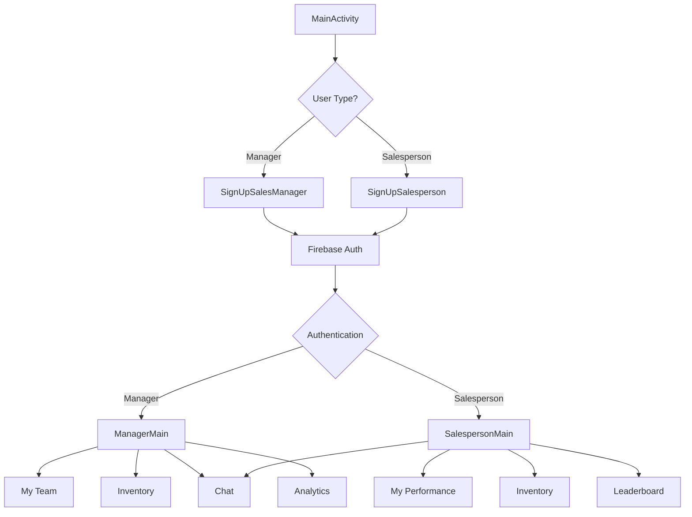

## Overview

The Sales Management App is an Android application built with Java that enables sales managers to coordinate with their sales teams, track inventory, analyze performance, and communicate in real-time.

### Technology Stack

<CardGroup cols={2}>
  <Card title="Android SDK" icon="android">
    Compiled with SDK version 26, minimum SDK 22
  </Card>
  <Card title="Firebase Suite" icon="fire">
    Authentication, Realtime Database, and Storage
  </Card>
  <Card title="Java" icon="java">
    Primary development language
  </Card>
  <Card title="Material Design" icon="palette">
    Android Support Library v26.1.0
  </Card>
</CardGroup>

## Package Structure

The application follows a feature-based package organization under the root package `project.avishkar.salesmanagement`:

```
project.avishkar.salesmanagement/
├── Registration/          # User authentication and signup flows
│   ├── MainActivity.java
│   ├── SignUpSalesManager.java
│   └── SignUpSalesperson.java
├── Chat/                  # Real-time messaging features
│   ├── ChatRoom.java
│   ├── PersonalChatActivityManager.java
│   ├── PersonalChatActivitySalesperson.java
│   └── Message handlers and adapters
├── Graph/                 # Performance analytics and visualization
│   ├── GraphManagerActivity.java
│   ├── GraphSalespersonActivity.java
│   └── GraphObject.java
├── Leaderboard/          # Sales performance rankings
│   ├── LeaderBoardSalesperson.java
│   ├── LeaderBoardAdapter.java
│   └── LeaderBoardObject.java
├── MyTeam/               # Team management features
│   └── MyTeam.java
└── Core Models           # Data models and utilities
    ├── SalesManager.java
    ├── SalesPerson.java
    ├── InventoryItem.java
    └── Constants.java
```

### Package Responsibilities

<AccordionGroup>
  <Accordion title="Registration Package">
    Handles user authentication and account creation for both sales managers and salespeople.
    
    **Key Activities:**
    - `MainActivity` - Entry point and login screen
    - `SignUpSalesManager` - Manager registration flow
    - `SignUpSalesperson` - Salesperson registration flow
    
    Integrates with Firebase Authentication for secure user management.
  </Accordion>

  <Accordion title="Chat Package">
    Provides real-time messaging capabilities between managers and their teams.
    
    **Key Components:**
    - Personal chat activities for managers and salespeople
    - Group chat room functionality
    - Message adapters and view holders for RecyclerView
    - Real-time synchronization with Firebase Database
  </Accordion>

  <Accordion title="Graph Package">
    Implements data visualization for sales performance metrics.
    
    **Features:**
    - MPAndroidChart library integration
    - Separate views for managers and salespeople
    - Performance tracking and trend analysis
  </Accordion>

  <Accordion title="Leaderboard Package">
    Displays top-performing salespeople based on sales metrics.
    
    **Implementation:**
    - Top ten sales rankings
    - Real-time updates from Firebase
    - Custom adapter for efficient list rendering
  </Accordion>

  <Accordion title="MyTeam Package">
    Allows managers to view and manage their sales team members.
    
    **Functionality:**
    - Team roster display
    - Individual performance monitoring
    - Team-wide inventory tracking
  </Accordion>
</AccordionGroup>

## Firebase Integration

The app leverages Firebase services for backend functionality:

### Core Firebase Dependencies

<CodeGroup>
```gradle build.gradle (App Level)
dependencies {
    // Firebase Core
    implementation 'com.google.firebase:firebase-core:16.0.1'
    
    // Firebase Authentication
    implementation 'com.google.firebase:firebase-auth:16.0.1'
    
    // Firebase Realtime Database
    implementation 'com.google.firebase:firebase-database:16.0.1'
    
    // Firebase Storage
    implementation 'com.google.firebase:firebase-storage:16.0.1'
    
    // Firebase UI for Storage
    implementation 'com.firebaseui:firebase-ui-storage:4.1.0'
    
    // Firebase Cloud Messaging
    compile 'com.google.firebase:firebase-messaging:10.2.1'
}

apply plugin: 'com.google.gms.google-services'
```

```gradle build.gradle (Project Level)
buildscript {
    dependencies {
        classpath 'com.google.gms:google-services:4.0.1'
    }
}
```
</CodeGroup>

### Firebase Service Usage

| Service | Purpose | Implementation |
|---------|---------|----------------|
| **Authentication** | User login and registration | Manages separate auth flows for managers and salespeople |
| **Realtime Database** | Store and sync data | User profiles, inventory, chat messages, leaderboard data |
| **Storage** | File uploads | Profile images, product images, documents |
| **Cloud Messaging** | Push notifications | Real-time alerts for messages and updates |

<Note>
  The app uses Firebase Realtime Database for real-time synchronization across all connected clients, ensuring instant updates for chat messages, inventory changes, and leaderboard rankings.
</Note>

## Application Configuration

### Android Manifest

The app is configured with the following key permissions and activities:

<CodeGroup>
```xml AndroidManifest.xml
<?xml version="1.0" encoding="utf-8"?>
<manifest xmlns:android="http://schemas.android.com/apk/res/android"
    package="project.avishkar.salesmanagement">

    <!-- Required Permissions -->
    <uses-permission android:name="android.permission.INTERNET" />
    <uses-permission android:name="android.permission.READ_EXTERNAL_STORAGE" />
    <uses-permission android:name="android.permission.WRITE_EXTERNAL_STORAGE" />

    <application
        android:allowBackup="true"
        android:icon="@mipmap/ic_launcher"
        android:label="@string/app_name"
        android:theme="@style/AppTheme">
        
        <!-- Main Entry Point -->
        <activity
            android:name=".Registration.MainActivity"
            android:theme="@style/Theme.AppCompat.NoActionBar"
            android:screenOrientation="portrait">
            <intent-filter>
                <action android:name="android.intent.action.MAIN" />
                <category android:name="android.intent.category.LAUNCHER" />
            </intent-filter>
        </activity>
        
        <!-- Registration Activities -->
        <activity android:name=".Registration.SignUpSalesManager" />
        <activity android:name=".Registration.SignUpSalesperson" />
        
        <!-- Main Activities -->
        <activity android:name=".ManagerMain" />
        <activity android:name=".SalespersonMain" />
        
        <!-- Chat Activities -->
        <activity android:name=".Chat.PersonalChatActivityManager" />
        <activity android:name=".Chat.PersonalChatActivitySalesperson" />
        <activity android:name=".Chat.ChatRoom" />
        
        <!-- Feature Activities -->
        <activity android:name=".MyTeam.MyTeam" />
        <activity android:name=".Leaderboard.LeaderBoardSalesperson" />
        <activity android:name=".Graph.GraphSalespersonActivity" />
        <activity android:name=".Graph.GraphManagerActivity" />
        
        <!-- File Provider for Storage -->
        <provider
            android:name="android.support.v4.content.FileProvider"
            android:authorities="${applicationId}"
            android:exported="false"
            android:grantUriPermissions="true">
            <meta-data
                android:name="android.support.FILE_PROVIDER_PATHS"
                android:resource="@xml/file_paths" />
        </provider>
    </application>
</manifest>
```
</CodeGroup>

<Warning>
  The app requires INTERNET, READ_EXTERNAL_STORAGE, and WRITE_EXTERNAL_STORAGE permissions to function properly. Users must grant these permissions for full functionality.
</Warning>

## Key Libraries

The app integrates several third-party libraries for enhanced functionality:

<ParamField path="MPAndroidChart" type="visualization">
  Chart library for rendering sales performance graphs and analytics
  ```gradle
  implementation 'com.github.PhilJay:MPAndroidChart:v3.0.3'
  ```
</ParamField>

<ParamField path="Glide" type="image-loading">
  Efficient image loading and caching for profile pictures and product images
  ```gradle
  implementation 'com.github.bumptech.glide:glide:4.8.0'
  ```
</ParamField>

<ParamField path="FancyAlertDialog" type="ui">
  Enhanced alert dialogs for better user experience
  ```gradle
  implementation 'com.github.Shashank02051997:FancyAlertDialog-Android:0.1'
  ```
</ParamField>

<ParamField path="SwipeMenuListView" type="ui">
  List view with swipe actions for inventory and team management
  ```gradle
  implementation 'com.baoyz.swipemenulistview:library:1.3.0'
  ```
</ParamField>

## Application Flow



## Next Steps

<CardGroup cols={2}>
  <Card title="Firebase Setup" icon="fire" href="/technical/firebase-setup">
    Configure Firebase services and database rules
  </Card>
  <Card title="Data Models" icon="database" href="/technical/data-models">
    Explore the core data models and their structure
  </Card>
</CardGroup>
