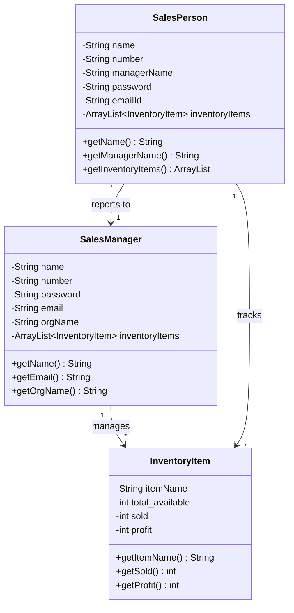

## Overview

The Sales Management App uses three primary data models to represent users and inventory data. These models are designed to work seamlessly with Firebase Realtime Database and follow Java POJO (Plain Old Java Object) patterns.

## SalesManager Model

The `SalesManager` class represents a sales manager user who oversees a team of salespeople and manages inventory.

### Class Definition

<CodeGroup>
```java SalesManager.java
package project.avishkar.salesmanagement;

import java.util.ArrayList;

public class SalesManager {
    private String name, number, password, email, orgName;
    private ArrayList<InventoryItem> inventoryItems;

    public SalesManager(){}
    
    public SalesManager(String name, String number, String password, 
                        String email, String orgName){
        this.name = name;
        this.number = number;
        this.password = password;
        this.email = email;
        this.orgName = orgName;
        this.inventoryItems = new ArrayList<>();
    }

    public String getEmail() {
        return email;
    }

    public String getOrgName() {
        return orgName;
    }

    public String getName() {
        return name;
    }

    public String getNumber() {
        return number;
    }

    public String getPassword() {
        return password;
    }
}
```
</CodeGroup>

### Properties

<ParamField path="name" type="String" required>
  The full name of the sales manager
  
  **Example:** `"John Doe"`
</ParamField>

<ParamField path="number" type="String" required>
  Contact phone number of the manager
  
  **Example:** `"+1234567890"`
</ParamField>

<ParamField path="password" type="String" required>
  User password (should be hashed in production)
  
  <Warning>
    Current implementation stores passwords. Recommended to use Firebase Authentication exclusively instead.
  </Warning>
</ParamField>

<ParamField path="email" type="String" required>
  Email address for authentication and communication
  
  **Example:** `"john.doe@company.com"`
</ParamField>

<ParamField path="orgName" type="String" required>
  Organization or company name that the manager represents
  
  **Example:** `"Acme Sales Corp"`
</ParamField>

<ParamField path="inventoryItems" type="ArrayList<InventoryItem>">
  List of inventory items managed by this sales manager
  
  Initialized as an empty ArrayList in the constructor
</ParamField>

### Usage Example

<CodeGroup>
```java Creating a Sales Manager
// Create a new sales manager instance
SalesManager manager = new SalesManager(
    "John Doe",
    "+1234567890",
    "securePassword123",
    "john.doe@company.com",
    "Acme Sales Corp"
);

// Save to Firebase Realtime Database
String userId = FirebaseAuth.getInstance().getCurrentUser().getUid();
FirebaseDatabase.getInstance()
    .getReference("salesManagers")
    .child(userId)
    .setValue(manager);
```

```java Retrieving a Sales Manager
// Fetch sales manager data from Firebase
String userId = FirebaseAuth.getInstance().getCurrentUser().getUid();
FirebaseDatabase.getInstance()
    .getReference("salesManagers")
    .child(userId)
    .addListenerForSingleValueEvent(new ValueEventListener() {
        @Override
        public void onDataChange(DataSnapshot dataSnapshot) {
            SalesManager manager = dataSnapshot.getValue(SalesManager.class);
            if (manager != null) {
                String managerName = manager.getName();
                String orgName = manager.getOrgName();
                // Use manager data...
            }
        }
        
        @Override
        public void onCancelled(DatabaseError databaseError) {
            // Handle error
        }
    });
```
</CodeGroup>

## SalesPerson Model

The `SalesPerson` class represents a salesperson who reports to a sales manager and tracks their own inventory sales.

### Class Definition

<CodeGroup>
```java SalesPerson.java
package project.avishkar.salesmanagement;

import android.support.v7.widget.RecyclerView;
import android.view.View;
import android.widget.TextView;

import org.w3c.dom.Text;

import java.util.ArrayList;

public class SalesPerson {
    private String name, number, managerName, password, emailId;
    private ArrayList<InventoryItem> inventoryItems;

    public SalesPerson(){}
    
    public SalesPerson(String name, String number, String password, 
                       String managerName, String Email) {
        this.name = name;
        this.number = number;
        this.password = password;
        this.managerName = managerName;
        this.emailId = Email;
        this.inventoryItems = new ArrayList<>();
    }

    public String getEmailId() {
        return emailId;
    }
    
    public String getName() {
        return name;
    }

    public String getNumber() {
        return number;
    }

    public String getManagerName() {
        return managerName;
    }

    public ArrayList<InventoryItem> getInventoryItems() {
        return inventoryItems;
    }

    public String getPassword() {
        return password;
    }
}
```
</CodeGroup>

### Properties

<ParamField path="name" type="String" required>
  The full name of the salesperson
  
  **Example:** `"Jane Smith"`
</ParamField>

<ParamField path="number" type="String" required>
  Contact phone number of the salesperson
  
  **Example:** `"+1234567891"`
</ParamField>

<ParamField path="managerName" type="String" required>
  Name of the sales manager this person reports to
  
  **Example:** `"John Doe"`
  
  <Note>
    This creates a relationship between salesperson and manager. Consider using manager UID for better data integrity.
  </Note>
</ParamField>

<ParamField path="password" type="String" required>
  User password for authentication
  
  <Warning>
    Should be managed through Firebase Authentication instead of storing directly.
  </Warning>
</ParamField>

<ParamField path="emailId" type="String" required>
  Email address for authentication and communication
  
  **Example:** `"jane.smith@company.com"`
</ParamField>

<ParamField path="inventoryItems" type="ArrayList<InventoryItem>">
  List of inventory items assigned to and tracked by this salesperson
  
  Initialized as an empty ArrayList. Items are added as the salesperson receives inventory.
</ParamField>

### Usage Example

<CodeGroup>
```java Creating a Sales Person
// Create a new salesperson instance
SalesPerson salesperson = new SalesPerson(
    "Jane Smith",
    "+1234567891",
    "securePassword456",
    "John Doe",  // Manager's name
    "jane.smith@company.com"
);

// Save to Firebase Realtime Database
String userId = FirebaseAuth.getInstance().getCurrentUser().getUid();
FirebaseDatabase.getInstance()
    .getReference("salesPeople")
    .child(userId)
    .setValue(salesperson);
```

```java Retrieving Inventory for Sales Person
// Fetch salesperson with their inventory
String userId = FirebaseAuth.getInstance().getCurrentUser().getUid();
FirebaseDatabase.getInstance()
    .getReference("salesPeople")
    .child(userId)
    .addValueEventListener(new ValueEventListener() {
        @Override
        public void onDataChange(DataSnapshot dataSnapshot) {
            SalesPerson salesperson = dataSnapshot.getValue(SalesPerson.class);
            if (salesperson != null) {
                ArrayList<InventoryItem> inventory = salesperson.getInventoryItems();
                // Display inventory in UI
                updateInventoryUI(inventory);
            }
        }
        
        @Override
        public void onCancelled(DatabaseError databaseError) {
            // Handle error
        }
    });
```
</CodeGroup>

## InventoryItem Model

The `InventoryItem` class represents a product in the inventory with tracking for availability, sales, and profit.

### Class Definition

<CodeGroup>
```java InventoryItem.java
package project.avishkar.salesmanagement;

public class InventoryItem {
    private String itemName;
    private int total_available, sold, profit;

    public InventoryItem(){
    }

    public InventoryItem(String itemName, int total_available, int sold, int profit)
    {
        this.itemName = itemName;
        this.total_available = total_available;
        this.sold = sold;
        this.profit = profit;
    }

    public InventoryItem(String itemName, int total_available, int sold)
    {
        this.itemName = itemName;
        this.total_available = total_available;
        this.sold = sold;
        this.profit = (this.total_available - this.sold);
    }

    public String getItemName() { 
        return itemName; 
    }

    public int getTotal_available() {
        return total_available;
    }

    public int getSold() {
        return sold;
    }

    public int getProfit() {
        return profit;
    }
}
```
</CodeGroup>

### Properties

<ParamField path="itemName" type="String" required>
  Name or description of the inventory item
  
  **Example:** `"Widget Pro 2000"`, `"Premium Package"`
</ParamField>

<ParamField path="total_available" type="int" required>
  Total quantity of items available in inventory
  
  **Example:** `100`
</ParamField>

<ParamField path="sold" type="int" required>
  Number of items sold from this inventory
  
  **Example:** `25`
</ParamField>

<ParamField path="profit" type="int">
  Calculated profit or remaining inventory
  
  **Calculation:** When using 3-parameter constructor, `profit = total_available - sold`
  
  **Example:** `75` (if 100 available and 25 sold)
  
  <Note>
    The naming suggests this represents profit, but the calculation shows it's actually remaining inventory. Consider renaming to `remaining` for clarity.
  </Note>
</ParamField>

### Constructors

The `InventoryItem` class provides three constructors:

<AccordionGroup>
  <Accordion title="Default Constructor">
    ```java
    public InventoryItem()
    ```
    
    Empty constructor required by Firebase for data deserialization.
  </Accordion>

  <Accordion title="Four-Parameter Constructor">
    ```java
    public InventoryItem(String itemName, int total_available, int sold, int profit)
    ```
    
    Allows explicit setting of all fields including profit. Use when profit is pre-calculated or represents actual monetary profit.
  </Accordion>

  <Accordion title="Three-Parameter Constructor (Auto-Calculate)">
    ```java
    public InventoryItem(String itemName, int total_available, int sold)
    ```
    
    Automatically calculates profit as `total_available - sold`. Use for simple inventory tracking.
  </Accordion>
</AccordionGroup>

### Usage Examples

<CodeGroup>
```java Creating Inventory Items
// Using auto-calculation constructor
InventoryItem item1 = new InventoryItem(
    "Widget Pro 2000",
    100,  // total available
    25    // sold
);
// profit automatically calculated as 75

// Using explicit profit constructor
InventoryItem item2 = new InventoryItem(
    "Premium Package",
    50,   // total available
    30,   // sold
    2000  // explicit profit value (e.g., monetary profit)
);

// Save to Firebase
FirebaseDatabase.getInstance()
    .getReference("inventory")
    .push()
    .setValue(item1);
```

```java Updating Inventory After Sale
// Update sold count when a sale is made
InventoryItem item = new InventoryItem("Widget Pro 2000", 100, 25);

// After selling 10 more units
InventoryItem updatedItem = new InventoryItem(
    item.getItemName(),
    item.getTotal_available(),
    item.getSold() + 10  // New sold count: 35
);
// Profit automatically recalculated as 65

// Update in Firebase
FirebaseDatabase.getInstance()
    .getReference("inventory")
    .child(itemId)
    .setValue(updatedItem);
```

```java Displaying Inventory in RecyclerView
public class InventoryAdapter extends RecyclerView.Adapter<InventoryViewHolder> {
    private ArrayList<InventoryItem> items;
    
    @Override
    public void onBindViewHolder(InventoryViewHolder holder, int position) {
        InventoryItem item = items.get(position);
        
        holder.nameText.setText(item.getItemName());
        holder.availableText.setText("Available: " + item.getTotal_available());
        holder.soldText.setText("Sold: " + item.getSold());
        holder.remainingText.setText("Remaining: " + item.getProfit());
        
        // Calculate percentage sold
        int percentSold = (item.getSold() * 100) / item.getTotal_available();
        holder.progressBar.setProgress(percentSold);
    }
}
```
</CodeGroup>

## Data Model Relationships



## Best Practices

<CardGroup cols={2}>
  <Card title="Use Firebase Auth" icon="shield-halved">
    Avoid storing passwords in data models. Use Firebase Authentication for all password management.
  </Card>
  
  <Card title="Add Setters" icon="pen">
    Current models only have getters. Add setter methods to enable field updates after object creation.
  </Card>
  
  <Card title="Use UIDs for Relations" icon="link">
    Instead of storing `managerName` as String, use manager's Firebase UID for reliable relationships.
  </Card>
  
  <Card title="Add Validation" icon="check">
    Implement validation methods to ensure data integrity (e.g., email format, non-negative inventory counts).
  </Card>
</CardGroup>

## Recommended Improvements

<Note>
  Consider these enhancements for production applications:
</Note>

### 1. Add Setter Methods

<CodeGroup>
```java Enhanced SalesManager
public class SalesManager {
    // ... existing fields ...
    
    // Add setters
    public void setName(String name) {
        this.name = name;
    }
    
    public void setEmail(String email) {
        this.email = email;
    }
    
    public void setInventoryItems(ArrayList<InventoryItem> items) {
        this.inventoryItems = items;
    }
    
    public void addInventoryItem(InventoryItem item) {
        this.inventoryItems.add(item);
    }
}
```
</CodeGroup>

### 2. Implement Parcelable

For passing objects between activities:

<CodeGroup>
```java Parcelable Implementation
public class InventoryItem implements Parcelable {
    // ... existing fields ...
    
    protected InventoryItem(Parcel in) {
        itemName = in.readString();
        total_available = in.readInt();
        sold = in.readInt();
        profit = in.readInt();
    }
    
    @Override
    public void writeToParcel(Parcel dest, int flags) {
        dest.writeString(itemName);
        dest.writeInt(total_available);
        dest.writeInt(sold);
        dest.writeInt(profit);
    }
    
    public static final Creator<InventoryItem> CREATOR = new Creator<InventoryItem>() {
        @Override
        public InventoryItem createFromParcel(Parcel in) {
            return new InventoryItem(in);
        }
        
        @Override
        public InventoryItem[] newArray(int size) {
            return new InventoryItem[size];
        }
    };
    
    @Override
    public int describeContents() {
        return 0;
    }
}
```
</CodeGroup>

### 3. Add Data Validation

<CodeGroup>
```java Validation Methods
public class SalesManager {
    // ... existing code ...
    
    public boolean isValid() {
        return name != null && !name.isEmpty()
            && email != null && isValidEmail(email)
            && number != null && !number.isEmpty()
            && orgName != null && !orgName.isEmpty();
    }
    
    private boolean isValidEmail(String email) {
        return email.matches("^[A-Za-z0-9+_.-]+@(.+)$");
    }
}
```
</CodeGroup>

## Next Steps

<CardGroup cols={2}>
  <Card title="Architecture" icon="diagram-project" href="/technical/architecture">
    Learn about the overall application architecture
  </Card>
  <Card title="Firebase Setup" icon="fire" href="/technical/firebase-setup">
    Configure Firebase to work with these data models
  </Card>
</CardGroup>
